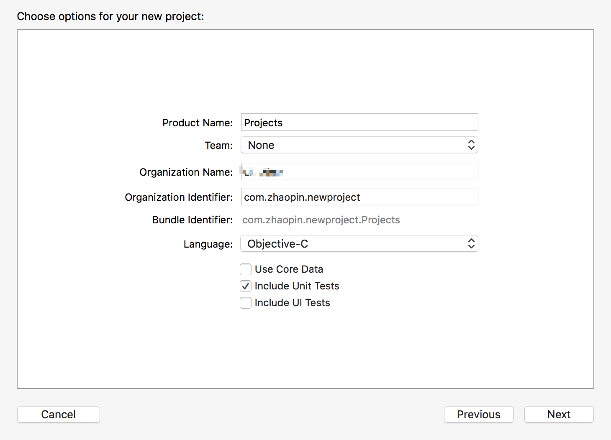
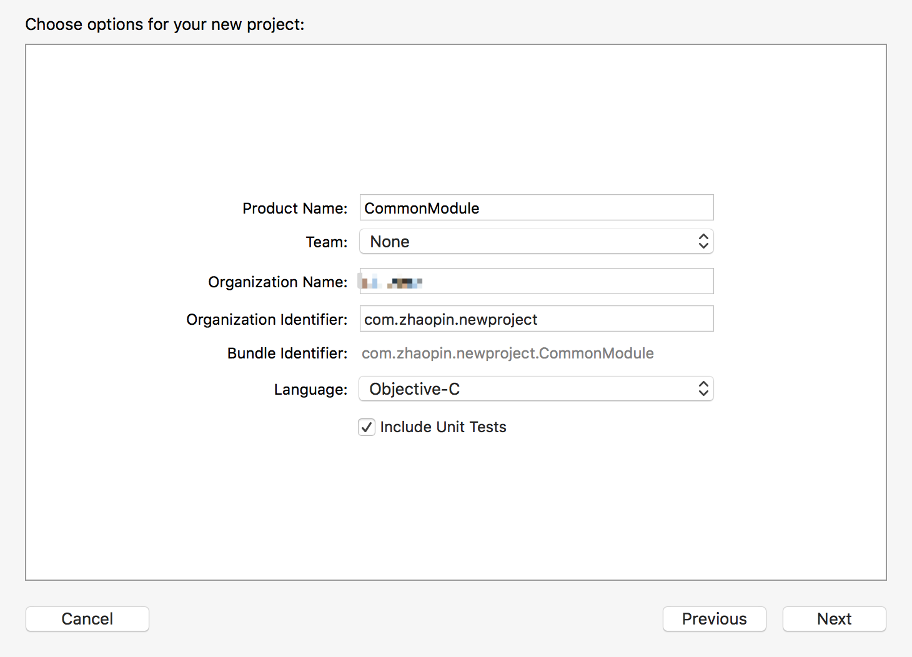
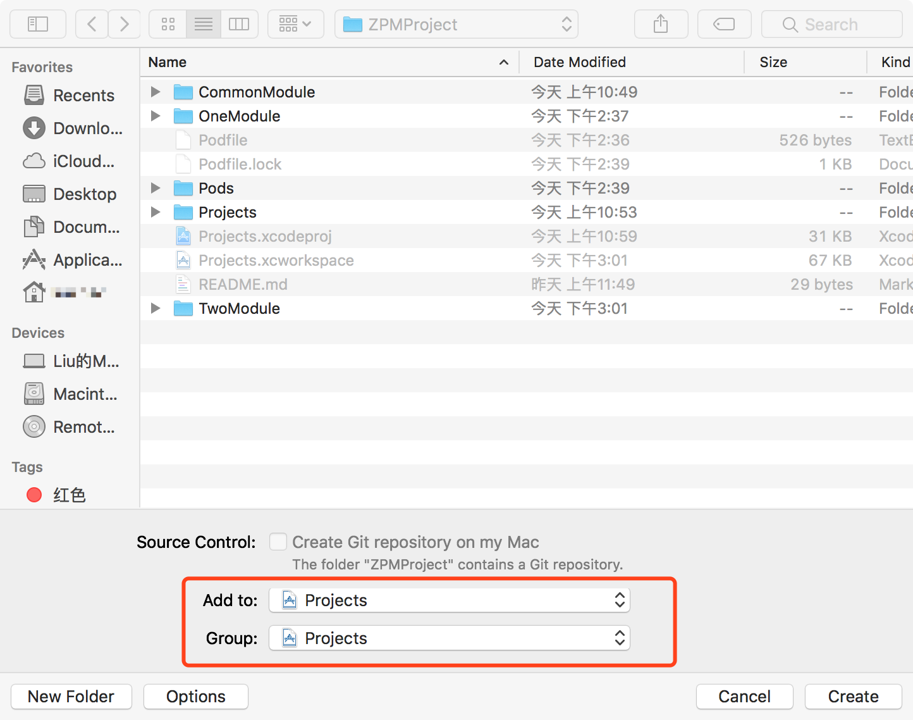
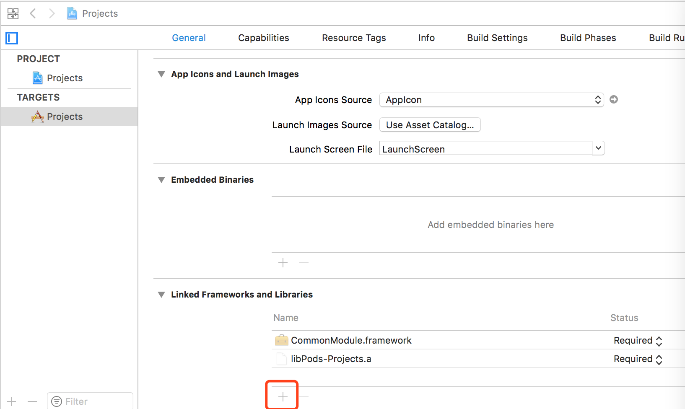
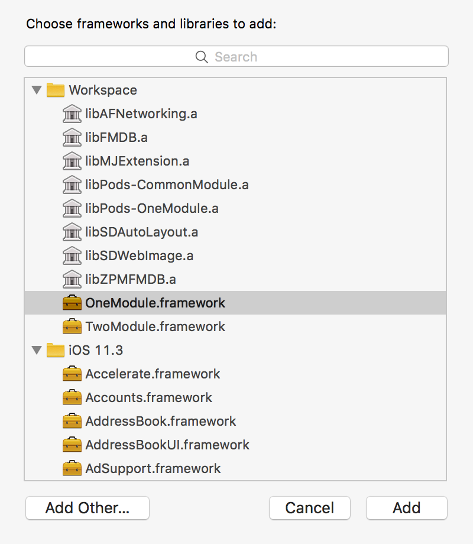
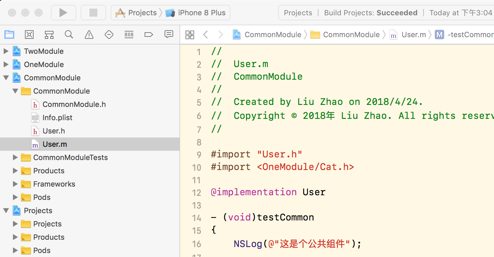
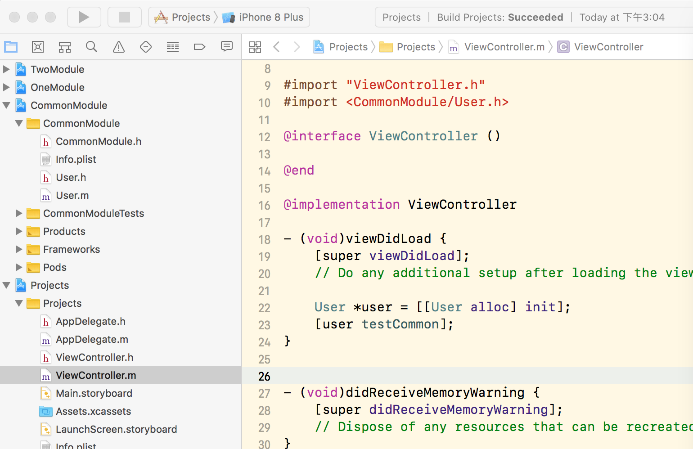
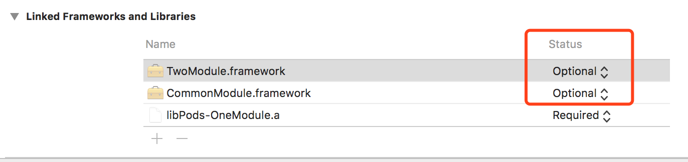
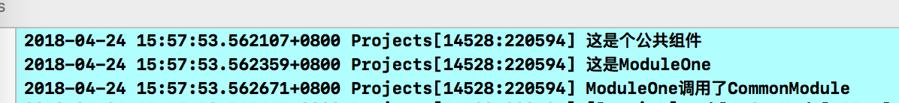

# 多工程联编

## 前文提要
当一个工程随着时间的推移，开发人员的增加，工程变得硕大且不好维护，提交代码冲突重重，是时候考虑项目的组件化了。若从一开始就走组件化之路绝逼是一个好办法。

组件化的目的是为了达到解耦，多工程联编更是达到了物理解耦，最理想的是各种模块可以随意的应用到其他的工程。每天蹲坑的时候也会在思索如何去走这条道路。蘑菇街以及反革命主义者的文章给我启发很大，综合两者不失为一种好办法。但本文章主要是介绍如何多工程联编，这几天抽空写了个Demo（写的比较随意，大家忽略细节），废话不多说直接上步骤。

效果图：

## 创建一个多工程

### 1、建立一个新工程

我们取名叫：Projects

工程少不了pods吧，于是我们先创建一个Podfile，让新工程支持cocoaspods，这样就会生成一个Projects.xcworkspace，这就是我们主工程的项目，之后的工程都将依赖于Projects.xcworkspace。

### 2、创建一个framework

我们创建一个framework工程，我们起名为CommonModule

主工程将它引入

然后在主工程（我们这里是Projects）的Build Settings的 Header Search Paths 和 Library Search Paths 都加入 ${SRCROOT}/CommonModule，然后在主工程的Targets中的General最下面的Linked Frameworks and Libraries里添加CommonModule.framework。
这样我们就可以在主工程里使用CommonModule里的东西了。

选择你要添加的framework

我们来测试一下
首先给CommonModule增加一个User类，给它随便添加一个方法。

在主工程Project里面的ViewController里，#import <CommonModule/User.h>

运行，输出

Yeah！第一模块搞定

然后再按照这个方法，再创建OneModule和TwoModule。

### 3、模块间的互相调用

主工程依赖CommonFramework和其他Framework没有问题，那么如果是模块间的互相调用呢？

其实道理是一样的，比如OneModule要调用TwoModule的类，只需要类似主工程一样，在OneModule的Build Settings的 Header Search Paths 和 Library Search Paths 都加入 ${SRCROOT}/../TwoModule（注意这里是加了/../，因为TwoModule是和OneModule同级，SRCROOT是直接获取到了OneModule，所以必须返回上一级），然后在OneModule的Targets中的General最下面的Linked Frameworks and Libraries里添加TwoModule.framework，这里注意一点，最好加入TwoModule.framework的时候，Status选择Optional而不是默认的Required，因为如果是Required，移动工程文件到别的路径后，会因为找不到路径运行报错。这样你得先删除运行后，再次添加才可以，所以建议还是直接选Optional。

这样的话，模块间的调用就类似主工程一样，可以任意调用了。

